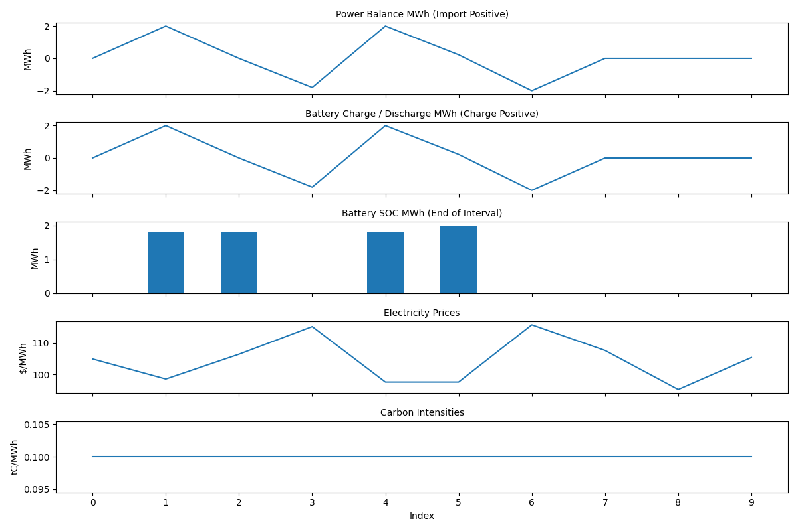
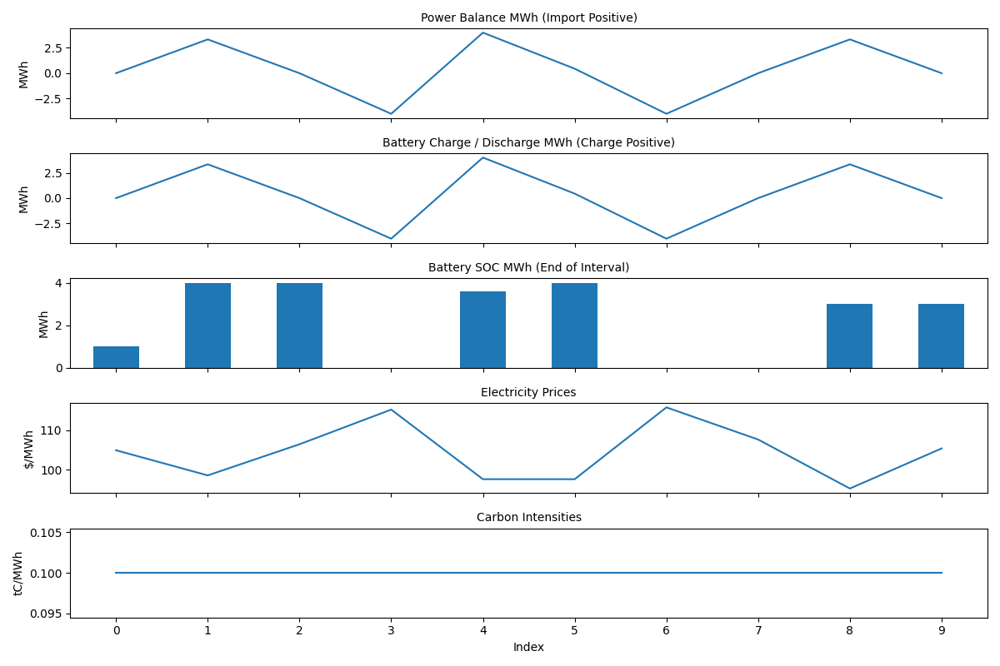

A natural response when you get access to something someone else built is to wonder - does this work correctly?

This section will give you confidence in the implementation of the battery asset.

## Price Dispatch Behaviour

Let's optimize a battery using a sequence of five prices.

We expect that the battery will charge when prices are low, and will discharge when prices are high.

In `energypylinear`, a positive site electricity balance is importing, and a negative site electricity balance is exporting.

```python
import energypylinear as epl

asset = epl.Battery(
    electricity_prices=[10, -50, 200, -50, 200],
)
simulation = asset.optimize(verbose=False)
print(simulation.results[["site-electricity_prices", "site-electricity_balance_mwh"]])
```

```
   site-electricity_prices  site-electricity_balance_mwh
0                       10                      0.444444
1                      -50                      2.000000
2                      200                     -2.000000
3                      -50                      2.000000
4                      200                     -2.000000
```

As expected, the battery charges (with a site that is positive) when prices are low and discharges (with a negative site electricity balance) when prices are high.

Now let's change the prices and see how the dispatch changes:

```python
import energypylinear as epl

asset = epl.Battery(
    electricity_prices=[200, -50, -50, 200, 220],
)
simulation = asset.optimize(verbose=False)
print(simulation.results[["site-electricity_prices", "site-electricity_balance_mwh"]])
```

```
   site-electricity_prices  site-electricity_balance_mwh
0                      200                           0.0
1                      -50                           2.0
2                      -50                           2.0
3                      200                          -1.6
4                      220                          -2.0
```

As expected, the battery continues to charge during low electricity price intervals, and discharge when electricity prices are high.

## Energy Balance

Let's return to our original set of prices and check the energy balance of the battery:

```python
import pandas as pd
import energypylinear as epl

pd.set_option("display.max_columns", 30)
pd.set_option("display.width", 400)

asset = epl.Battery(
    electricity_prices=[10, -50, 200, -50, 200],
)
simulation = asset.optimize(verbose=False)

checks = epl.check_results(simulation.results, verbose=False)
balance = checks["electricity-balance"]
print(balance)
```

```
      input  accumulation  output  balance    import  generation  export  load    charge  discharge      loss  spills  soc
0  0.444444     -0.444444     0.0     True  0.444444         0.0     0.0   0.0  0.444444        0.0  0.044444     0.0  0.0
1  2.000000     -2.000000     0.0     True  2.000000         0.0     0.0   0.0  2.000000        0.0  0.200000     0.0  0.0
2  0.000000      2.000000     2.0     True  0.000000         0.0     2.0   0.0  0.000000        2.0  0.000000     0.0  0.0
3  2.000000     -2.000000     0.0     True  2.000000         0.0     0.0   0.0  2.000000        0.0  0.200000     0.0  0.0
4  0.000000      2.000000     2.0     True  0.000000         0.0     2.0   0.0  0.000000        2.0  0.000000     0.0  0.0
```

In the first interval, we charge the battery with `0.444444 MWh` - `0.4 MWh` goes into increasing the battery state of charge from `0.0 MWh` to `0.4 MWh`, with the balance `0.044444 MWh` going to battery losses.

## Battery Efficiency

We can validate the performance of the battery efficiency by checking the losses across different battery efficiencies:

```python
import numpy as np
import pandas as pd
import energypylinear as epl

np.random.seed(42)
prices = np.random.uniform(-100, 100, 12) + 100

out = []
for efficiency_pct in [1.0, 0.9, 0.8]:
    asset = epl.Battery(
        power_mw=4,
        capacity_mwh=10,
        efficiency_pct=efficiency_pct,
        electricity_prices=prices,
    )
    simulation = asset.optimize(
        objective="price",
        verbose=False
    )
    results = simulation.results
    out.append(
        {
            "eff_pct": efficiency_pct,
            "charge_mwh": results["battery-electric_charge_mwh"].sum(),
            "discharge_mwh": results["battery-electric_discharge_mwh"].sum(),
            "loss_mwh": results["battery-electric_loss_mwh"].sum(),
            "prices_$_mwh": results["site-electricity_prices"].mean(),
            "import_mwh": results["site-import_power_mwh"].sum(),
            "objective": (results["site-import_power_mwh"] - results["site-export_power_mwh"] * results["site-electricity_prices"]).sum(),
        }
    )

print(pd.DataFrame(out))
```

```
   eff_pct  charge_mwh  discharge_mwh  loss_mwh  prices_$_mwh  import_mwh    objective
0      1.0   18.000000           18.0  0.000000    103.197695   18.000000 -3018.344310
1      0.9   19.111111           17.2  1.911111    103.197695   19.111111 -2893.086854
2      0.8   20.000000           16.0  4.000000    103.197695   20.000000 -2719.962419
```

From the above we observe the following as efficiency decreases:

- an increase in battery losses,
- a reduction in the amount charged and discharged,
- a increase in the objective function, which represents an increase in cost or decrease in value of the battery arbitrage.

## State of Charge & Power Ratings

We can demonstrate the state of charge and battery power settings by first optimizing a battery and showing it's plot:

```python
import numpy as np
import energypylinear as epl

np.random.seed(42)
electricity_prices = np.random.normal(100, 10, 10).tolist()

asset = epl.Battery(power_mw=2, capacity_mwh=4, electricity_prices=electricity_prices)
results = asset.optimize()
asset.plot(results, path="./docs/docs/static/battery.png")
```



Takeaways:

- the battery state of charge is constrained between 0 and 4 MWh,
- the battery power rating is constrained between -2 and 2 MW,
- battery SOC starts empty and ends empty.

```python
import numpy as np
import energypylinear as epl

np.random.seed(42)

asset = epl.Battery(
    power_mw=4,
    capacity_mwh=8,
    electricity_prices=np.random.normal(100, 10, 10),
    initial_charge_mwh=1.0,
    final_charge_mwh=3.0
)
results = asset.optimize()
asset.plot(results, path="./docs/docs/static/battery-fast.png")
```



Takeaways:

- battery SOC starts at 1 MWh and ends at 3 MWh.
